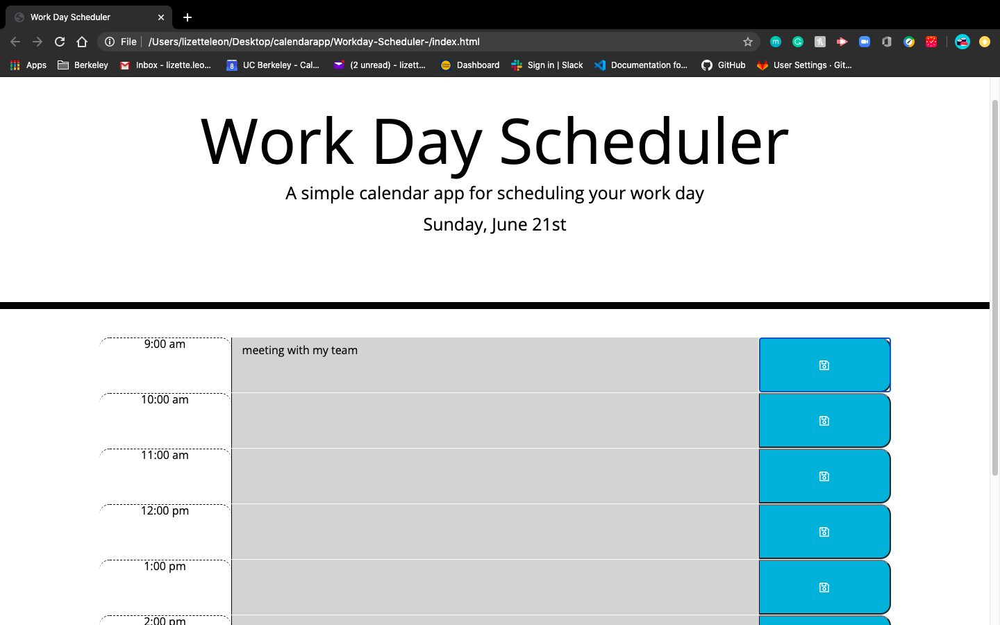

# Work Day Scheduler Starter Code
<!DOCTYPE html>

<html lang="en-us">
    <head>
        <meta charset="UTF-8" />
    </head>
    <header>
        <h2>
            Description
        </h2>
            

            In this assignment the user will have access to a planner in which the user can schedule evens during a specific time block. Depending on when the event is scheduled the time block will change color to advice the user if the event is in the past, present or future. Everytime a user adds and saves an event it is saved in local storage. 
            

        <h2>
            Technologies Used:
        </h2>   
            

                HTML, CSS, Javascript, Third Party APIs
            

    <header>
    <section>
      
    </section>
    <section>
        

            The URL of the deployed application
            <a href="">The URL of the deployed application</a>
        

    </section>
    <section>
        

            The URL of the GitHub repository 
            <a href="">The URL of the Git</a>
        

    </section>